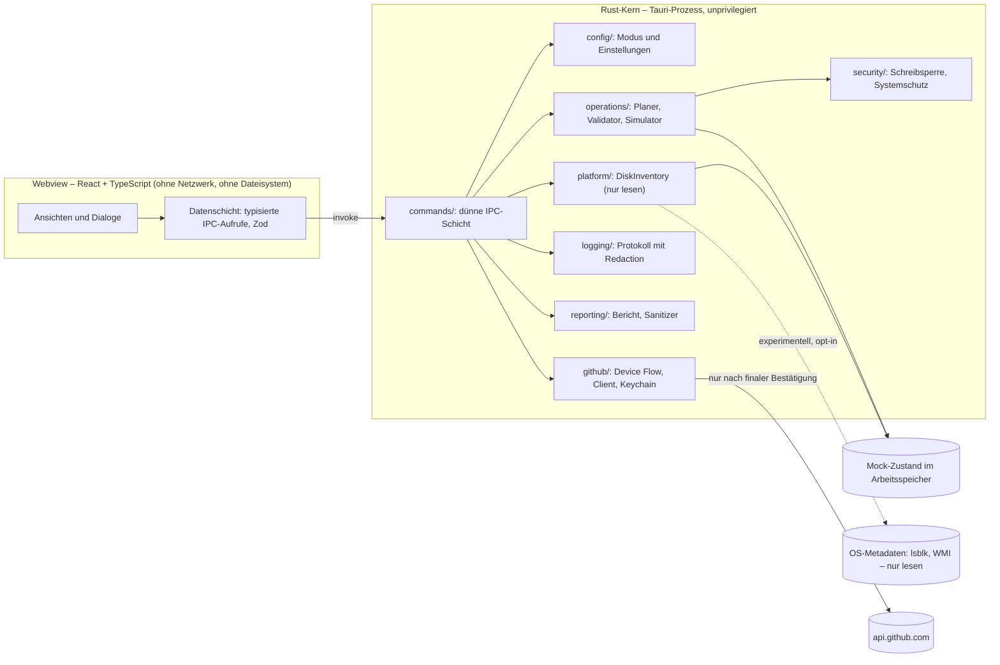
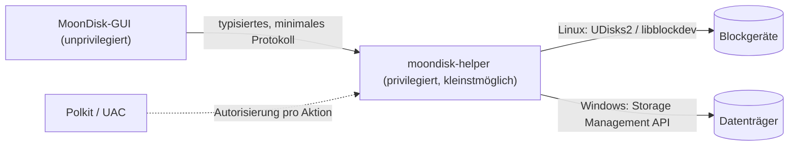

# MoonDisk – Architektur

> **Status:** Konzept (Phase 1) · **Zielversion:** `0.1.0-alpha.1`
>
> Verwandte Dokumente: [Sicherheitsmodell](safety-model.md) ·
> [Unterstützte Operationen](supported-operations.md) ·
> [Bug-Reporter](bug-reporter.md) · [Branding](branding.md) ·
> [Roadmap](roadmap.md) · [Release-Prozess](release-process.md)

## 1. Leitprinzipien

1. **Die Alpha verändert keine echten Datenträger.** Das wird nicht über einen
   Schalter gesteuert. Es ist garantiert, weil für echte Geräte schlicht kein
   Schreibcode existiert (siehe [Sicherheitsmodell](safety-model.md#3-alpha-schreibsperre)).
2. **Planen → Prüfen → Simulieren → Bestätigen.** Keine Aktion wirkt sofort.
3. **Rust ist die einzige Quelle der Wahrheit.** Validierung, Simulation,
   Anonymisierung und jeder Netzwerkzugriff liegen im Backend. Das Frontend stellt
   dar und sammelt Eingaben, trifft aber keine sicherheitsrelevanten Entscheidungen.
4. **Minimale Angriffsfläche.** Die Webview hat keinen Netzwerk-, Dateisystem-
   oder Shell-Zugriff und darf nur explizit freigegebene Commands aufrufen.
5. **Lokal und privat.** Keine Telemetrie, kein Tracking, keine Konten.
   Netzwerkverkehr gibt es nur, wenn der Nutzer ausdrücklich einen GitHub-Versand
   auslöst.
6. **Ehrlich kommunizieren.** Experimentelles wird gekennzeichnet. Was nicht
   implementiert ist, wird nicht vorgetäuscht.

## 2. Anforderungsanalyse

### 2.1 Harte Grenzen für `0.1.0-alpha.1`

- Keine Schreiboperationen auf echte Datenträger und keine schreibenden
  Systemwerkzeuge (DiskPart, PowerShell-Storage-Cmdlets, `parted`, `fdisk`,
  `mkfs`, `dd` …).
- Der Mock-Modus ist Standard. Read-only muss aktiv eingeschaltet werden und ist
  experimentell. `production` schreibt ebenfalls nicht.
- Kein Datenversand ohne vollständige Vorschau und ausdrückliche Bestätigung,
  kein eingebauter Token.
- Keine Telemetrie, kein Tracking, keine Cloud-Pflicht.

### 2.2 Funktionale Kernbereiche

| Bereich                          | Umfang in Alpha                                            | Detail                                                  |
| -------------------------------- | ---------------------------------------------------------- | ------------------------------------------------------- |
| Datenträger- und Partitionsansicht | Mock vollständig, Read-only experimentell (optional)       | §8, [Sicherheitsmodell §4](safety-model.md#4-betriebsmodi-und-sicherer-mock-modus) |
| Operationsplaner und Dry-Run     | nur im Mock-Modus                                          | [Sicherheitsmodell §5](safety-model.md#5-operationsplaner) |
| Sicherheitsdialoge               | vollständig (für simulierte Aktionen)                      | [Sicherheitsmodell §7](safety-model.md#7-risikostufen-und-bestätigungen) |
| Logs und Fehlerdarstellung       | Ansicht, Filter, Export                                    | [Sicherheitsmodell §9](safety-model.md#9-protokollierung-und-geheimnisse) |
| Einstellungen                    | Sprache, Theme, Animationen, simulierte Plattformansicht   | §7                                                      |
| Bug-Reporter                     | Prüfen, Kopieren, Speichern, Browser; Direktversand nur unter Bedingungen | [Bug-Reporter](bug-reporter.md)          |
| Lokalisierung                    | Deutsch (Standard), Englisch                               | §7                                                      |
| Qualität                         | Tests, Linting, CI unter Windows und Linux                 | [Release-Prozess](release-process.md)                   |

### 2.3 Erkenntnisse und Konflikte aus der Analyse

| #   | Beobachtung | Konsequenz / Vorschlag |
| --- | ----------- | ---------------------- |
| A1  | Die vorhandene `LICENSE` ist MIT (© 2026 Luna). Gefordert ist GPL-3.0-or-later. | Die Lizenz kann nur der Rechteinhaber ändern → **Entscheidung D1** ([Roadmap](roadmap.md#6-offene-entscheidungen)). Bis dahin bleibt `LICENSE` unverändert. |
| A2  | Das Repository heißt `Luna-OS/MoonDisk`, die Vorgabe lautet `moondisk`. | GitHub-URLs unterscheiden keine Groß-/Kleinschreibung. Vorgeschlagenes Standardziel: `Luna-OS/MoonDisk` (**D2**). Crate- und Paketnamen bleiben `moondisk`. |
| A3  | Die GitHub-REST-API verwirft Labels beim Anlegen eines Issues **stillschweigend**, wenn die meldende Person keinen Push-Zugriff hat. | Bei normalen Nutzern kommen Labels also praktisch nie an. Lösung: ein sichtbarer Metadatenblock im Bericht und ein Label-Workflow im Repository ([Bug-Reporter §9](bug-reporter.md#9-labels)). Der geforderte Neuversuch ohne Labels bleibt für HTTP 422 erhalten. |
| A4  | Der Windows-MSI-Bundler (WiX) akzeptiert keine alphanumerischen Pre-Release-Versionen wie `-alpha.1`. | Windows-Alpha-Builds werden NSIS-Installer, MSI folgt später. In Phase 19 zu verifizieren ([Release-Prozess §5](release-process.md#5-alpha-release-workflow)). |
| A5  | `LÖSCHEN` lässt sich auf nicht-deutschen Tastaturen schwer tippen. | Vorschlag: sprachabhängige Phrase (`LÖSCHEN` / `DELETE`). Das Backend prüft gegen die aktive Sprache (**D4**). |
| A6  | `production` darf in der Alpha nichts schreiben. | `production` verhält sich in der Alpha genau wie `readonly` und zeigt zusätzlich „Produktionsmodus in dieser Version nicht verfügbar“. |
| A7  | Die Anonymisierung wird auch für lokale Exporte und Logs gebraucht, nicht nur für GitHub. | Sanitizer und Berichtserzeugung kommen in ein eigenes Modul `reporting/`. `github/` enthält nur Anmeldung, Client, Schlüsselspeicher und API-Payload. |
| A8  | Tailwind CSS v4 definiert Design-Tokens in CSS (`@theme`). | Ein `tailwind.config.ts` ist nicht nötig, die Tokens liegen in `src/styles/tokens.css`. Das weicht von der Beispielstruktur ab. |
| A9  | Der sichtbare Zustand darf sich erst nach Dry-Run und Bestätigung ändern. Nutzer sollen aber sehen, was geplant ist. | Zwei getrennte Ansichten: „Aktueller Zustand“ und „Vorschau nach Plan“, die Vorschau deutlich als solche gekennzeichnet. |
| A10 | Ein veralteter Plan muss testbar sein, obwohl sich Mock-Daten sonst nie von selbst ändern. | Mock-Werkzeuge: „Externe Änderung simulieren“, „USB-Datenträger simuliert trennen“, „Szenario zurücksetzen“. |
| A11 | Was erlaubt ist, hängt stark vom Dateisystem ab (z. B. lässt sich XFS nicht verkleinern). | Das Regelwerk steht in [Unterstützte Operationen](supported-operations.md). Der Mock wendet dieselben Regeln an, die später für echte Operationen gelten sollen. |
| A12 | Die Mock-Daten sollen Hersteller und Modelle zeigen. | Hersteller und Modelle sind **fiktiv**. So gibt es weder Verwechslungen mit echter Hardware noch Markenprobleme. |
| A13 | Einsprungpunkte in die Webview (Clipboard, Datei speichern, Browser öffnen) vergrößern die Angriffsfläche. | Diese Plugins werden nur aus Rust genutzt. Die Webview bekommt keine Plugin-Berechtigungen (§6). |

## 3. Systemüberblick



Die gesamte App läuft **ohne erhöhte Rechte**. Für spätere schreibende
Versionen ist ein getrennter, minimaler Hilfsprozess mit erhöhten Rechten
vorgesehen (§11). In der Alpha existiert er nicht.

## 4. Technologieauswahl

Die Vorgaben (Rust, Tauri, React, TypeScript, Vite, Tailwind, Lucide, Zod,
Serde, Tokio, Vitest, ESLint, Prettier, rustfmt, clippy, GitHub Actions) werden
übernommen. Ergänzungen und ihre Begründung:

| Bereich | Wahl | Begründung |
| ------- | ---- | ---------- |
| Backend | Rust (stable; MSRV wird in Phase 2 festgelegt) | Speichersicherheit. Das Typsystem kann Sicherheitsgarantien tragen (z. B. existiert kein Schreib-Trait für echte Geräte). Gute Plattform-APIs (`windows`, `wmi`, später `zbus`). |
| Desktop | **Tauri 2** | Kleine Pakete, nutzt die System-Webview statt eines gebündelten Chromium, IPC über ein feingranulares Capability-/Permission-System, Backend nativ in Rust. |
| Frontend | React + TypeScript (`strict`) | Weit verbreitet, gute Barrierefreiheits-Bibliotheken, große Contributor-Basis. |
| Build | Vite | Offizieller Tauri-Weg, schnelle Entwicklung. |
| Styling | Tailwind CSS v4 | Design-Tokens zentral in CSS, konsistentes helles und dunkles Theme. |
| **Barrierefreie UI-Bausteine** | Radix UI Primitives | Dialoge mit Fokusfalle, Tooltips und Menüs mit vollständiger Tastaturbedienung und korrektem ARIA. Für Sicherheitsdialoge ist das entscheidend. |
| Icons | Lucide | Offene Lizenz (ISC), einheitlicher Stil. |
| Validierung (Frontend) | Zod | Formulare, Prüfung von IPC-Antworten. |
| **Lokalisierung** | i18next + react-i18next | Pluralformen, Interpolation, getrennte Dateien `de.json` und `en.json`. |
| **Datenabfrage** | TanStack Query | Einheitliche Lade- und Fehlerzustände, gezieltes Aktualisieren. |
| **Routing** | React Router (Hash-Router) | Funktioniert ohne Server. |
| **IPC-Typen** | ts-rs | TypeScript-Typen werden aus Rust-Structs generiert. Frontend und Backend können dadurch nicht auseinanderlaufen. CI prüft, ob die generierten Dateien aktuell sind. |
| Serialisierung | serde, serde_json, toml | Datenmodelle, Konfiguration. |
| Fehlerbehandlung | thiserror | Typisierte Fehler mit stabilen Fehlercodes. |
| Logging | tracing, tracing-subscriber, eigener Redaction-Layer | Strukturierte Logs, sensible Werte werden schon beim Schreiben maskiert. |
| Zeit, IDs, Hashes | time, uuid, sha2 | UTC-Zeitstempel, Operations-IDs, Zustands-Fingerprints. |
| **Geheimnisse** | secrecy, zeroize | Tokens tauchen nie in Debug-Ausgaben auf, ihr Speicher wird beim Verwerfen geleert. |
| Schlüsselspeicher | keyring | Windows Credential Manager, Linux Secret Service (GNOME Keyring, KWallet). |
| HTTP (nur GitHub) | reqwest mit rustls | Kein OpenSSL, TLS-Prüfung immer aktiv. Liegt hinter einem Transport-Trait, damit Tests nie ins Netz gehen. |
| Asynchronität | tokio (über Tauri) | Netzwerk, Timeouts, Device-Flow-Polling. |
| Betriebssystem-Infos | os_info | Name, Version und Architektur für Bug-Reports. |
| Windows Read-only | wmi (COM-Abfragen auf `MSFT_Disk`, `MSFT_Partition`, `MSFT_Volume`) | Keine Prozessaufrufe, kein PowerShell, kein DiskPart. |
| Linux Read-only | `lsblk --json` mit festen Argumenten + sysfs; später UDisks2 über `zbus` | Keine Shell, keine Nutzereingaben in Argumenten. |
| Frontend-Tests | Vitest, Testing Library, vitest-axe, `@tauri-apps/api/mocks` | Komponenten- und Barrierefreiheitstests mit simuliertem IPC. |
| Abhängigkeitsprüfung | cargo-deny, `npm audit`, Dependabot | Lizenzen, Advisories, verbotene Crates. |
| Icon-Pipeline | resvg (CLI), `tauri icon` | Reproduzierbares PNG/ICO aus SVG. Nur Build-Werkzeug, wird nicht ausgeliefert. |

**Geprüfte Alternativen:**

- **Electron:** bündelt Chromium und Node.js. Das ergibt deutlich größere Pakete
  und eine größere Angriffsfläche, weil Node im Hauptprozess läuft.
- **Rust-native GUIs (egui, Iced, Slint):** kein Webview nötig, aber schwächere
  Unterstützung für Screenreader. Das Designsystem wäre aufwendiger umzusetzen.
- **Qt oder Flutter:** Der Kern wäre nicht in Rust, oder die Toolchain wäre
  komplexer.

Nicht verwendet werden die Tauri-Plugins `shell`, `fs`, `http`, `updater` und
`process`. cargo-deny und der Safety-Scan verhindern ihre Aufnahme
([Release-Prozess §3](release-process.md#3-safety-scan)).

## 5. Rust-Backend

### 5.1 Module und Verantwortlichkeiten

| Modul | Verantwortung | Status in Alpha |
| ----- | ------------- | --------------- |
| `commands/` | Tauri-Commands: deserialisieren, validieren, an Services delegieren, Fehler auf DTOs abbilden. Keine Geschäftslogik. | aktiv |
| `config/` | Modus ermitteln (`MOONDISK_MODE`), Einstellungen laden und speichern, GitHub-Konfiguration | aktiv |
| `models/` | `Disk`, `Partition`, `FileSystem`, `ByteSize`, `Lba`, IDs, `Sensitive<T>` | aktiv |
| `platform/` | Trait `DiskInventory` (nur lesen) und Provider | aktiv |
| `platform/mock/` | `MockDiskProvider`, Szenarien, Fehlerinjektion | **aktiv (Standard)** |
| `platform/linux_readonly.rs` | `LinuxReadOnlyProvider` (lsblk + sysfs) | optional, experimentell (D5) |
| `platform/windows_readonly.rs` | `WindowsReadOnlyProvider` (WMI) | optional, experimentell (D5) |
| `platform/process.rs` | Einziger erlaubter Weg für Prozessaufrufe: `ReadOnlyTool`-Enum mit festen Argumenten | nur Linux Read-only |
| `operations/` | `OperationPlanner`, `OperationValidator`, `Simulator`, Risikobewertung | aktiv |
| `operations/executor.rs` | Trait `DiskOperationExecutor`, einzige Implementierung: `MockExecutor` | aktiv (nur Mock) |
| `security/` | Schreibsperre, `SystemProtection`, Prüfung der Bestätigungsphrase, Eingabevalidierung, `PrivilegeStatus` (nur Erkennung) | aktiv |
| `logging/` | Ringpuffer, rotierende Logdatei, Redaction-Layer, Export | aktiv |
| `reporting/` | Bug-Report-Modell, Markdown, Titel, Diagnoseauswahl, **Sanitizer** | aktiv |
| `github/` | `auth.rs` (Device Flow), `client.rs` (Transport-Trait + reqwest), `issue_report.rs` (API-Payload, Labels), `keychain.rs`, `tests.rs` | Browser-Fallback aktiv, Direktversand nach D3 |

**Zuordnung zu den vorgegebenen Modulnamen:**

| Vorgabe | MoonDisk | Anmerkung |
| ------- | -------- | --------- |
| `DiskProvider` + `PartitionProvider` | `DiskInventory` | Partitionen gehören zum Datenträger-Snapshot. Ein eigener Provider würde nur Inkonsistenzen erzeugen. |
| `DiskOperationExecutor` | `DiskOperationExecutor` | Einzige Implementierung in der Alpha: `MockExecutor`. |
| `OperationPlanner`, `OperationValidator` | unverändert | `operations/planner.rs`, `operations/validator.rs` |
| `PrivilegeManager` | `PrivilegeStatus` | Erkennt nur, ob die App mit erhöhten Rechten läuft (Hinweis in der UI). Sie fordert keine Rechte an. |
| `SystemProtection` | unverändert | `security/system_protection.rs` |
| `SmartInfoProvider` | `SmartInfoProvider` | In der Alpha nur simulierte Zusammenfassungen. |
| `MockDiskProvider`, `WindowsReadOnlyProvider`, `LinuxReadOnlyProvider` | unverändert | siehe oben |

### 5.2 Zentrale Schnittstellen (Skizze)

```rust
/// Rein lesender Zugriff auf Datenträgerinformationen.
/// Keine Implementierung darf Geräte öffnen oder verändern.
pub trait DiskInventory: Send + Sync {
    fn source(&self) -> InventorySource; // Mock | LinuxReadOnly | WindowsReadOnly
    fn list_disks(&self) -> Result<Vec<Disk>, InventoryError>;
    fn disk(&self, id: &DiskId) -> Result<Disk, InventoryError>;
}

/// Führt einen per Dry-Run geprüften Plan aus.
/// In 0.1.0-alpha.x gibt es ausschließlich `MockExecutor`,
/// der nur auf dem In-Memory-Zustand `MockState` arbeitet.
pub trait DiskOperationExecutor {
    fn execute(
        &mut self,
        plan: &ValidatedPlan,
        ticket: DryRunTicket,
        confirmation: Confirmation,
    ) -> Result<ExecutionReport, ExecutionError>;
}
```

### 5.3 Datenmodell (Auszug)

```rust
pub struct Disk {
    pub id: DiskId,                    // stabil, z. B. "mock-disk-0"
    pub display_name: String,          // "Datenträger 0"
    pub vendor: String,                // im Mock fiktiv
    pub model: String,
    pub serial: Sensitive<String>,     // nie in Logs oder Berichten
    pub bus: BusType,                  // Sata | Nvme | Usb | Virtual | Unknown
    pub media: MediaType,              // Hdd | Ssd | Flash | Virtual
    pub size: ByteSize,
    pub logical_sector_size: u32,      // 512 | 4096
    pub table: PartitionTable,         // Gpt | Mbr | None
    pub health: HealthStatus,          // Ok | Warning | Failing | Unknown
    pub smart: Option<SmartSummary>,   // simuliert
    pub flags: DiskFlags,              // system, removable, read_only
    pub layout: Vec<Segment>,          // sortiert, lückenlos
}

pub enum Segment {
    Partition(Partition),
    Unallocated(FreeRegion),
}

pub struct Partition {
    pub id: PartitionId,
    pub number: u32,
    pub range: LbaRange,               // Start + Länge in Sektoren
    pub used: Option<ByteSize>,
    pub fs: FileSystem,                // Ntfs | Fat32 | ExFat | Ext2 | Ext3 | Ext4
                                       // | Btrfs | Xfs | LinuxSwap | Unformatted | Unknown
    pub kind: PartitionKind,           // Efi | MsReserved | Recovery | Boot | BasicData
                                       // | LinuxFs | LinuxSwap | Other
    pub label: Option<Sensitive<String>>,
    pub flags: PartitionFlags,         // boot, system, active_mount, locked
    pub drive_letter: Option<DriveLetter>,           // simulierte Windows-Ansicht
    pub mountpoints: Vec<Sensitive<MountPoint>>,     // simulierte Linux-Ansicht
}
```

- **Größen** werden intern als `u64` Bytes oder Sektoren geführt. Über IPC
  fließen sie als Zahl bis `2^53 − 1` (8 PiB), weil JavaScript größere Ganzzahlen
  nicht verlustfrei darstellt. Die Grenze wird geprüft.
- **`Sensitive<T>`** gibt in `Debug` und in Logs `<redacted>` aus. Der
  Diagnose- und Berichtsbaustein muss solche Werte ausdrücklich anonymisieren.
  Datenschutz wird damit vom Typsystem unterstützt.
- **Anzeigeeinheiten:** IEC-Einheiten (GiB, MiB) mit lokalisiertem
  Zahlenformat. Die Herstellerkapazität erscheint zusätzlich in SI-Einheiten,
  z. B. „1 TB (931,5 GiB)“.

## 6. IPC-Grenze und Tauri-Sicherheitskonfiguration

### 6.1 Commands in der Alpha

| Gruppe | Commands | Hinweis |
| ------ | -------- | ------- |
| App | `app_info` | Version, Modus, Plattform, Status der Feature-Flags |
| Datenträger | `disks_list`, `disk_get` | über `DiskInventory` |
| Plan | `plan_get`, `plan_add`, `plan_remove`, `plan_reset`, `plan_preview` | typisierte `OperationRequest`-Enums |
| Simulation | `plan_dry_run`, `plan_apply` | `plan_apply` verlangt ein gültiges Dry-Run-Ticket und die nötigen Bestätigungen |
| Mock-Werkzeuge | `mock_reset`, `mock_external_change`, `mock_toggle_device` | im Backend nur im Mock-Modus erlaubt |
| Regeln | `validation_rules` | Das Frontend übernimmt Grenzwerte (Label-Längen, Mindestgrößen) vom Backend statt sie zu duplizieren |
| Logs | `logs_get`, `logs_export` | Export über einen Speichern-Dialog, den Rust öffnet |
| Einstellungen | `settings_get`, `settings_update` | |
| Bug-Report | `report_preview`, `report_copy`, `report_save`, `report_browser_target`, `report_open_browser` | Alle Ausgaben beziehen sich auf eine vom Backend erzeugte Vorschau-ID |
| GitHub | `github_status`, `github_login_start`, `github_login_poll`, `github_login_cancel`, `github_logout`, `github_prepare_send`, `github_send`, `github_open_issue` | siehe [Bug-Reporter](bug-reporter.md) |

Regeln für jeden Command:

- Die Anfrage ist ein typisiertes Struct mit `#[serde(deny_unknown_fields)]`.
  IDs sind Newtypes und werden auf Format und Existenz geprüft.
- Das Backend validiert vollständig, auch wenn das Frontend schon validiert hat.
- Fehler werden als `AppError { code, message_key, params }` zurückgegeben,
  ohne interne Pfade oder Stacktraces.
- Commands werden per App-Manifest (`tauri-build`) als Permissions deklariert
  und in der Capability-Datei einzeln freigegeben. Die Umsetzung wird in
  Phase 2 verifiziert.

### 6.2 Capabilities, Plugins und CSP

- **Eine Capability** (`capabilities/main.json`) für das Hauptfenster. Sie
  enthält ausschließlich die minimal nötigen `core:`-Permissions und die
  App-Commands. Wildcards sind verboten.
- `tauri-plugin-dialog`, `tauri-plugin-clipboard-manager` und
  `tauri-plugin-opener` werden **nur aus Rust** genutzt. Die Webview bekommt
  **keine** Plugin-Permissions. Deshalb kann die Webview …
  - keine beliebigen Dateien schreiben (Rust öffnet den Speichern-Dialog und
    schreibt selbst),
  - keine beliebigen URLs öffnen (Rust baut die GitHub-URLs aus der
    Konfiguration und prüft sie gegen eine Allowlist),
  - die Zwischenablage nur mit dem vom Backend bereinigten Bericht füllen.
- Strikte **Content Security Policy** ohne externe Quellen, zum Beispiel
  `default-src 'self'; connect-src ipc: http://ipc.localhost; img-src 'self';
  font-src 'self'; object-src 'none'; frame-src 'none'`. Die endgültige
  Fassung wird in Phase 2 festgelegt.
- `withGlobalTauri: false`, keine Remote-Inhalte, DevTools nur in Debug-Builds.
- Schriften und alle Assets werden lokal gebündelt. Es gibt kein CDN und kein
  Google Fonts.

## 7. Frontend-Architektur

```text
src/
├── app/            App-Shell, Routen, Provider (Query, i18n, Theme), Layout, Mock-Banner
├── components/     Wiederverwendbare UI-Bausteine (Button, Card, Badge, Dialog-Wrapper,
│                   Tooltip, Banner, SizeText, Mascot)
├── features/
│   ├── disks/            Übersicht, Datenträgerkarten, Detailseite
│   ├── partitions/       Partitionsbalken, Legende, Detailpanel, Aktionsmenü
│   ├── operation-plan/   Plan, Vorschau, Dry-Run, Sicherheitsdialoge, Ergebnisprotokoll
│   ├── bug-reporter/     Formular, Diagnoseauswahl, Vorschau, Ausgabewege, GitHub
│   ├── settings/         Sprache, Theme, Animationen, Mock-Werkzeuge
│   └── diagnostics/      Log-Ansicht, Filter, Export
├── i18n/           de.json, en.json, Initialisierung, Formatierung (Zahlen, Größen, Datum)
├── lib/            ipc.ts (typisierte invoke-Wrapper), Hilfsfunktionen
├── styles/         tokens.css (Design-Tokens), Basis-CSS, Schriften
├── types/generated/  von ts-rs erzeugt, nicht manuell bearbeiten
└── test/           Setup, Fixtures, IPC-Mocks
```

Grundsätze:

- **Keine Geschäftslogik im Frontend.** Zod-Schemas dienen der sofortigen
  Rückmeldung in Formularen. Die maßgebliche Prüfung macht das Backend. Die
  Grenzwerte kommen aus `validation_rules`.
- **Keine direkten Netzwerkzugriffe.** `fetch`, `XMLHttpRequest` und
  `WebSocket` sind per ESLint-Regel verboten, zusätzlich blockiert die CSP.
- **Kein `dangerouslySetInnerHTML`** (ESLint-Regel). Labels und andere
  Freitexte werden immer escaped.
- **Barrierefreiheit:** sichtbarer Fokus, Skip-Link, Landmarks, Live-Regionen
  für Dry-Run-Ergebnisse, vollständige Tastaturbedienung des Partitionsbalkens
  (Pfeiltasten zwischen Segmenten, Enter zum Auswählen, jedes Segment mit
  zugänglichem Namen wie „Partition 3, NTFS, 800 GiB, Laufwerk C:“).
  Informationen werden nie allein über Farbe vermittelt. `prefers-reduced-motion`
  wird respektiert, dazu gibt es eine eigene Einstellung für Animationen.
- **Simulierte Plattformansicht:** Einstellung „Windows-Ansicht“ oder
  „Linux-Ansicht“, Standard ist das Host-System. Sie bestimmt, ob
  Laufwerksbuchstaben oder Mountpoints im Vordergrund stehen. So lassen sich
  beide Varianten auf jedem Betriebssystem testen.

## 8. Betriebsmodi

| Modus | Datenquelle | Planer / Dry-Run | Schreibt echte Daten | Banner (Deutsch) |
| ----- | ----------- | ---------------- | -------------------- | ---------------- |
| `mock` (Standard) | `MockDiskProvider` | ja, simuliert | **nie** | „Mock-Modus aktiv – es werden keine echten Laufwerke verändert.“ |
| `readonly` (experimentell) | `LinuxReadOnlyProvider` / `WindowsReadOnlyProvider` | nein; Aktionen deaktiviert mit Begründung | **nie** | „Experimenteller Read-only-Modus – echte Laufwerke werden ausschließlich gelesen.“ |
| `production` | wie `readonly` | nein | **nie** | „Der Produktionsmodus ist in dieser Alpha nicht verfügbar. MoonDisk arbeitet nur lesend.“ |

So wird der Modus ermittelt, beim App-Start und nur einmal:

1. Umgebungsvariable `MOONDISK_MODE` (`mock` | `readonly` | `production`)
2. Einstellungsdatei im App-Konfigurationsverzeichnis. Für `readonly` muss
   dort zusätzlich die Bestätigung des Experimentierhinweises gespeichert sein.
3. Standard: `mock`

Ungültige Werte führen zu `mock`, einem Warn-Log und einem Hinweis in der UI.
Ein Moduswechsel in den Einstellungen gilt erst **nach einem Neustart** und
setzt den Operationsplan zurück. Mock-Szenarien lassen sich zusätzlich über
`MOONDISK_MOCK_SCENARIO` wählen
([Sicherheitsmodell §4.3](safety-model.md#43-mock-szenarien)).

## 9. Logging und Fehler

- Jeder Fehler hat einen **stabilen Code** (`E_NO_ADJACENT_SPACE`, …) und
  einen Übersetzungsschlüssel. Die Codes sind nicht sensibel und dürfen in
  Bug-Reports erscheinen. Liste: [Unterstützte Operationen §7](supported-operations.md#7-fehler--und-warncodes).
- Logs gehen in einen Ringpuffer im Arbeitsspeicher (für die Log-Ansicht) und
  in eine rotierende Datei im App-Log-Verzeichnis. Sensible Muster werden
  schon beim Schreiben maskiert
  ([Sicherheitsmodell §9](safety-model.md#9-protokollierung-und-geheimnisse)).

## 10. Projektstruktur

Die Struktur folgt der Vorgabe mit begründeten Abweichungen (markiert mit ✱):

```text
moondisk/
├── README.md · LICENSE · CONTRIBUTING.md · SECURITY.md · CHANGELOG.md · THIRD_PARTY_LICENSES.md
├── .gitignore · .editorconfig · .prettierrc · eslint.config.js
├── package.json · package-lock.json · tsconfig.json · vite.config.ts
├── deny.toml ✱                      cargo-deny: Lizenzen, Advisories, verbotene Crates
├── .github/
│   ├── workflows/
│   │   ├── ci.yml
│   │   ├── release-alpha.yml
│   │   ├── issue-labeler.yml ✱     Labels für API-Issues (siehe Bug-Reporter §9)
│   │   └── sync-labels.yml ✱       Labels aus labels.yml anlegen/aktualisieren
│   ├── ISSUE_TEMPLATE/ bug_report.yml · feature_request.yml · config.yml
│   ├── labels.yml ✱
│   ├── CODEOWNERS ✱                Pflicht-Review für sicherheitskritische Pfade
│   ├── pull_request_template.md ✱
│   └── dependabot.yml
├── assets/
│   ├── branding/  moondisk-icon.svg · moondisk-icon-small.svg ✱ · moondisk-logo.svg ·
│   │              moondisk-axolotl.svg · moondisk-mascot.svg · mascot/ ✱ (Posen)
│   └── icons/     icon-16.png … icon-512.png · icon.ico
├── docs/          architecture.md · branding.md · safety-model.md · supported-operations.md ·
│                  bug-reporter.md ✱ · release-process.md ✱ · icon-conversion.md · roadmap.md ·
│                  alpha-testing.md · alpha-release-checklist.md
├── scripts/ ✱     safety-scan.mjs · i18n-check.mjs · render-icons.mjs · check-version.mjs
├── src/           siehe §7 (✱ styles/ statt tailwind.config.ts, Tailwind v4)
└── src-tauri/
    ├── Cargo.toml · Cargo.lock · build.rs · tauri.conf.json
    ├── capabilities/main.json
    ├── icons/                         aus assets/ erzeugt (tauri icon)
    ├── config/github.example.toml     echte github.toml ist per .gitignore ausgeschlossen
    └── src/
        ├── main.rs · lib.rs · app_state.rs ✱
        ├── commands/ ✱                dünne IPC-Schicht
        ├── config/ ✱
        ├── models/
        ├── platform/  mod.rs · process.rs ✱ · mock/ (mod.rs, scenarios.rs, faults.rs) ·
        │              windows_readonly.rs · linux_readonly.rs
        ├── operations/  mod.rs · planner.rs · validator.rs · simulator.rs · executor.rs · risk.rs
        ├── security/    write_barrier.rs · system_protection.rs · confirmation.rs · input.rs ·
        │                privilege.rs
        ├── logging/
        ├── reporting/ ✱ mod.rs · report.rs · markdown.rs · diagnostics.rs · sanitizer.rs
        ├── github/      mod.rs · auth.rs · client.rs · issue_report.rs · keychain.rs · tests.rs
        └── tests/       Integrationstests (Planer-Workflows, Modus-Garantien)
```

`services/` aus der Vorgabe entfällt. Die Rolle übernehmen `operations/`,
`reporting/` und `github/`, jeweils mit klarer Zuständigkeit. `sanitizer.rs`
liegt in `reporting/` statt in `github/`, weil auch lokale Exporte und Logs ihn
verwenden (A7).

## 11. Plattformrisiken und Einschränkungen

### 11.1 Windows 10/11

| Risiko | Auswirkung | Umgang |
| ------ | ---------- | ------ |
| Viele Datenträgerabfragen brauchen Administratorrechte | Read-only-Erkennung ohne Rechte eventuell unvollständig | WMI-Storage-Namespace ohne Erhöhung nutzen und in Phase 11a verifizieren. Fehlende Felder als „unbekannt“ anzeigen, nie mit Rechten nachfordern. |
| DiskPart ist textbasiert und die Ausgabe ist lokalisiert | Parsen wäre fehleranfällig und gefährlich | DiskPart nicht verwenden. Später höchstens als streng kontrollierte Ausnahme. |
| BitLocker, dynamische Datenträger, Storage Spaces | Komplexe Sonderfälle, Datenverlust bei Fehlbehandlung | Alpha: nur als „nicht unterstützt“ erkennen und anzeigen, keine Aktionen. |
| MSR- und Recovery-Partitionen, versteckte GPT-Attribute | Unbeabsichtigtes Beschädigen der Wiederherstellung | Grundsätzlich geschützt ([Unterstützte Operationen §6](supported-operations.md#6-sonderpartitionen-und-systemschutz)). |
| WebView2-Runtime nötig | Start schlägt fehl, wenn sie fehlt (seltene Windows-10-Installationen) | NSIS-Installer mit WebView2-Bootstrapper, Hinweis in der README. |
| Unsignierte Builds | SmartScreen-Warnung, Vertrauensfrage | Alpha: dokumentieren, Prüfsummen und Build-Provenance anbieten. Code-Signing später. |
| MSI-Versionsformat | `-alpha.1` im MSI nicht erlaubt (A4) | NSIS für die Alpha. |
| Antivirus-Fehlalarme bei neuen, unsignierten Binärdateien | Tester können die App nicht starten | In den Known Issues dokumentieren, gegebenenfalls Einreichung bei Herstellern. |

### 11.2 Linux (Ubuntu, Debian, Fedora, Arch)

| Risiko | Auswirkung | Umgang |
| ------ | ---------- | ------ |
| Tauri 2 braucht WebKitGTK 4.1 | Sehr alte Distributionen nicht unterstützt | Mindestens Ubuntu 22.04, Debian 12, aktuelle Fedora- und Arch-Versionen, dokumentieren. Release-Builds auf `ubuntu-22.04` für breite glibc-Kompatibilität. |
| Darstellungsprobleme mit Wayland/NVIDIA (DMA-BUF-Renderer) | Leeres oder flackerndes Fenster | Bekannte Workarounds dokumentieren (z. B. `WEBKIT_DISABLE_DMABUF_RENDERER=1`). |
| GUI als root ist problematisch (Wayland verbietet es meist) | Später ist Schreiben nicht einfach „mit sudo“ möglich | Architektur mit getrenntem Hilfsprozess und Polkit (§11.4). Die Alpha braucht kein root und warnt, wenn sie so gestartet wird. |
| `lsblk`-Ausgabe unterscheidet sich je nach util-linux-Version | Parserfehler, falsche Anzeige | Robuster Parser, Fixtures von allen Zieldistributionen, `MOUNTPOINTS` und `MOUNTPOINT` unterstützen. |
| Loop-, zram-, device-mapper-, LVM-, LUKS- und mdraid-Geräte, Snap-Loop-Devices | Unübersichtliche oder irreführende Anzeige | Filtern oder als „nicht unterstützt“ markieren. Keine Aktionen. |
| Btrfs-Subvolumes (mehrere Mountpoints pro Partition) | Mountpoint-Semantik ist komplex | Mehrere Mountpoints pro Partition modellieren (`Vec<MountPoint>`). |
| Kein Secret Service bei minimalen Desktops | Token kann nicht dauerhaft gespeichert werden | Option „Angemeldet bleiben“ dann deaktiviert. Token nur für die Sitzung, **nie** Klartext-Fallback. |
| AppImage braucht FUSE 2 (fehlt z. B. unter Ubuntu 22.04+ standardmäßig) | AppImage startet nicht | Zusätzlich `.deb` und `.rpm` anbieten, Hinweis in der README. |
| Flatpak/Snap sperren den Zugriff auf Blockgeräte | Read-only-Erkennung eingeschränkt | Keine Flatpak/Snap-Pakete in der Alpha. |

### 11.3 Plattformübergreifend

- **Inhärentes Datenverlustrisiko** eines Partitionsmanagers. Die Alpha
  vermeidet es vollständig, weil sie nicht schreibt. Spätere Versionen brauchen
  die Freigabekriterien aus [Sicherheitsmodell §10](safety-model.md#10-voraussetzungen-für-echte-schreiboperationen-in-späteren-versionen).
- **Die Simulation ist nicht die Realität.** Die Regeln im Mock sind
  vereinfacht. Jede Ergebnisanzeige trägt deshalb den Hinweis „Simulation“.
  Grenzwerte sind als Näherung dokumentiert.
- **Lieferkette:** npm- und Crate-Abhängigkeiten sind ein Einfallstor.
  Gegenmittel: wenige Abhängigkeiten, Lockfiles, `npm ci`, cargo-deny,
  per SHA gepinnte Actions, Review jeder neuen Abhängigkeit.
- **Webview-Unterschiede** (WebView2 und WebKitGTK) bei CSS und Fokusverhalten
  erfordern manuelle Tests auf beiden Plattformen.

### 11.4 Ausblick: Architektur für spätere Schreiboperationen

Nur zur Einordnung, **nicht Teil der Alpha**:



Der Helper nimmt ausschließlich vollständig validierte, typisierte Operationen
an, keine Befehle. Er validiert selbst noch einmal gegen den frischen echten
Zustand und verweigert geschützte Ziele.
