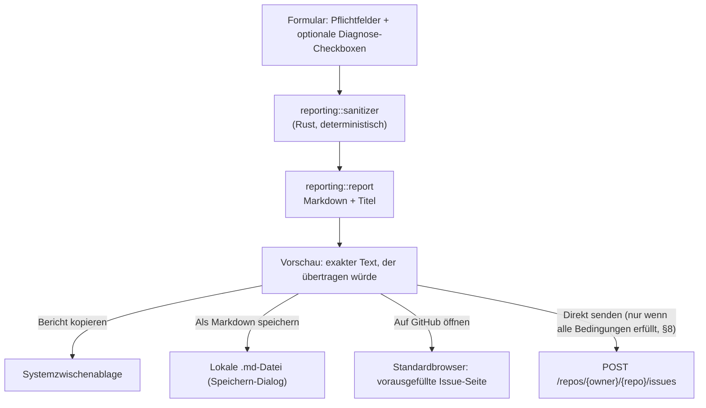

# MoonDisk – Bug-Reporter: Datenschutz- und Sicherheitsmodell

> **Status:** Konzept (Phase 1). Die Implementierung entsteht in **Phase 13**
> (ohne Direktversand) und **Phase 15** (Anmeldung und Direktversand).
>
> Verwandte Dokumente: [Architektur](architecture.md) · [Sicherheitsmodell](safety-model.md) ·
> [Roadmap, Entscheidung D3](roadmap.md#6-offene-entscheidungen)

## 1. Grundprinzip

Der Bug-Reporter ist **ohne jede GitHub-Anmeldung vollständig nutzbar**. Er
sendet **nie** automatisch Daten. Jede Stufe – Anzeigen der Vorschau, Kopieren,
Speichern, Browser öffnen, API-Versand – braucht eine **eigene, bewusste
Aktion** der Nutzerin oder des Nutzers. Es gibt keinen impliziten Versand
(kein automatisches Senden bei Abstürzen, kein „Telemetrie“-Kanal).

## 2. Datenfluss



Der Sanitizer (B) liegt in `reporting/`, nicht in `github/`, weil dieselbe
Bereinigung auch für lokale Exporte und Logs gilt
([Architektur, A7](architecture.md#23-erkenntnisse-und-konflikte-aus-der-analyse)).
Die Vorschau (D) zeigt **immer** exakt den Text, der bei Kopieren, Speichern
oder Senden verwendet würde – es gibt keine „stille“ zusätzliche Bereinigung
danach.

## 3. Pflichtfelder und Metadaten

| Feld | Pflicht | Herkunft |
| ---- | :-: | -------- |
| Kurzbeschreibung | ✓ | Eingabe |
| Erwartetes Verhalten | ✓ | Eingabe |
| Tatsächliches Verhalten | ✓ | Eingabe |
| Schritte zur Reproduktion | ✓ | Eingabe |
| Schweregrad (Keine Auswirkung/Klein/Mittel/Hoch/Kritisch) | ✓ | Auswahl |
| MoonDisk-Version | automatisch | Build-Metadaten |
| Betriebssystem und Version | automatisch, **vor Versand sichtbar** | `os_info` |
| App-Modus (Mock/Read-only/Production) | automatisch | Laufzeitkonfiguration |
| Sprache | automatisch | aktuelle UI-Sprache |
| Zusätzlicher Kontext | optional | Eingabe |
| Datenschutz-Checkbox „keine Geheimnisse“ | ✓ zum Fortfahren | Bestätigung |
| Datenschutz-Checkbox „Sichtbarkeit auf GitHub verstanden“ | ✓ zum Fortfahren | Bestätigung |

Beide Checkboxen sind Voraussetzung für **jede** Ausgabeart, nicht nur für den
Direktversand – auch Kopieren und Speichern erzeugen einen Bericht, der auf
GitHub landen könnte, sobald der Nutzer ihn selbst einfügt.

## 4. Optionale Diagnoseinformationen

Jede Information ist einzeln per Checkbox aktivierbar (Standard: **aus**, mit
Ausnahme von App-Version und Modus, die aus Sicht des Fehlerberichts meist
notwendig sind und daher standardmäßig **an**, aber weiterhin abwählbar):

| Information | Standard | Inhalt |
| ------------ | :-: | ------ |
| MoonDisk-App-Version | an | Versionsnummer, Git-Kurz-Hash des Builds |
| Betriebssystem und Version | an | z. B. „Windows 11 23H2“, „Ubuntu 24.04“ |
| CPU-Architektur | an | `x86_64`, `aarch64` |
| Aktiver MoonDisk-Modus | an | `mock` \| `readonly` \| `production` |
| App-Einstellungen ohne persönliche Daten | aus | Sprache, Theme, Animationsstufe, gewählte Mock-Szenario-ID |
| Letzte MoonDisk-Logs nach Anonymisierung | aus | die letzten *n* Zeilen aus dem Ringpuffer, **nach** demselben Sanitizer wie der restliche Bericht |
| Aktivierte Funktionen | aus | Liste aktiver Feature-Flags |
| Nicht sensible Fehlercodes | aus | Codes aus [Unterstützte Operationen §7](supported-operations.md#7-fehler--und-warncodes), keine Freitextmeldungen |
| Anonymisierte Hardware-/Datenträgerübersicht | aus | siehe §6 |

## 5. Anonymisierung

Der Sanitizer arbeitet **regelbasiert und deterministisch** (keine
KI-Heuristik, damit das Verhalten testbar und vorhersagbar ist) und läuft auf
**jedem** Textbaustein, bevor er in die Vorschau gelangt:

| Kategorie | Erkennung (vereinfacht) | Ersetzung |
| --------- | ------------------------ | --------- |
| Geheimnisse (Tokens, API-Schlüssel, private Schlüssel, Passwörter in URLs) | Muster bekannter Token-Formate (`ghp_…`, `gho_…`, `github_pat_…`, generische `Bearer …`), `-----BEGIN …PRIVATE KEY-----`, Passwort-Parameter in URLs | `<entfernt: möglicher Zugangsdaten-Wert>` (Feld wird komplett verworfen, nicht nur maskiert) |
| Benutzername in Pfaden | `C:\Users\<Name>\…`, `/home/<Name>/…`, `/Users/<Name>/…` | `C:\Users\<user>\…` bzw. `/home/<user>/…` |
| Vollständige persönliche Pfade | beliebige weitere Pfadsegmente nach dem Benutzernamen | nur der Teil nach dem Benutzernamen bleibt, bis zu einer konfigurierten Tiefe (z. B. `…\Documents\<gekürzt>`) |
| IP-Adressen | IPv4-/IPv6-Muster | `<ip-entfernt>` |
| MAC-Adressen | `xx:xx:xx:xx:xx:xx` | `<mac-entfernt>` |
| Seriennummern | bekannte Feldwerte aus dem Datenmodell (`Sensitive<String>`), nicht aus Freitext erraten | Feld wird nicht in den Bericht übernommen |
| Vollständige Datenträger-/Partitions-IDs | interne UUIDs/IDs | durch stabile, **innerhalb des Berichts** konsistente Platzhalter ersetzt (`Datenträger A`, `Partition A1`), damit der Bericht weiterhin verständlich bleibt |
| E-Mail-Adressen im Freitext | einfaches E-Mail-Muster | `<e-mail-entfernt>` |

Freitext-Felder (Beschreibung, Reproduktionsschritte, zusätzlicher Kontext)
durchlaufen **dieselben** Muster wie automatisch erhobene Diagnosedaten. Der
Sanitizer kann Freitext nicht vollständig gegen unbedachte Angaben schützen
(z. B. wenn jemand ein Passwort ausgeschrieben in einem Satz nennt, ohne dass
es wie ein erkennbares Token aussieht) – deshalb bleibt die
**Bestätigungscheckbox** (§3) und die **Vorschau vor jedem Versand** die
letzte, entscheidende Sicherung. Der Bug-Reporter behauptet nirgends, Freitext
lückenlos zu bereinigen.

## 6. Anonymisierte Datenträgerübersicht

Nur wenn die Checkbox aktiv ist, wird eine **abstrahierte** Übersicht erzeugt:

```text
- Datenträger A: NVMe, GPT, 1 TB, Zustand OK
  - Partition A1: EFI, 100 MiB
  - Partition A2: NTFS, 900 GiB, Laufwerksbuchstabe vorhanden
- Datenträger B: SATA-HDD, MBR, 2 TB, Zustand Warnung
  - Partition B1: NTFS, 900 GiB
  - nicht zugewiesen: 263 GiB
```

Was **nie** enthalten ist: Seriennummern, vollständige Datenträger-/
Partitions-IDs, unbereinigte Labels (Labels werden komplett weggelassen, nicht
nur gekürzt – ein Label kann persönliche Information tragen, z. B.
„Annas-Backup“), Benutzernamen, vollständige persönliche Pfade, vollständige
Mountpoints (nur der Fakt „Mountpoint vorhanden“ erscheint, nicht der Pfad,
außer der Nutzer aktiviert Mountpoints separat – **D6, offen für Phase 13**,
Standardannahme: **nicht enthalten**), Netzwerk-, IP- oder MAC-Adressen.

## 7. GitHub-Anmeldung (Device Flow)

- **Nur Device Flow** oder ein sicherer browserbasierter OAuth-Flow, **nie**
  eine Passwortabfrage in MoonDisk selbst.
- Die eigentliche Anmeldeseite öffnet ausschließlich im **Systembrowser**.
- Ablauf: MoonDisk fordert einen Device-/User-Code an → zeigt ihn an und
  öffnet `github.com/login/device` im Browser → pollt (mit vom Server
  vorgegebenem Intervall, `slow_down` wird respektiert) → bei Erfolg wird das
  Token **sofort** in den OS-Schlüsselspeicher geschrieben (`keyring`-Crate:
  Windows Credential Manager, Linux Secret Service) und **nie** im Klartext auf
  der Festplatte abgelegt.
- Nach Anmeldung: Anzeige des GitHub-Benutzernamens (über `GET /user`), nicht
  mehr.
- Vor jedem Versand wird die Token-Berechtigung indirekt über die
  API-Antwort geprüft (kein separater Scope-Check nötig, ein fehlgeschlagener
  Issue-Request mit 403/404 wird als „keine ausreichende Berechtigung“
  erklärt).
- **Abmelden** löscht das Token vollständig aus dem Schlüsselspeicher
  (`keyring::delete_credential` bzw. Äquivalent) und aus dem Arbeitsspeicher
  (`Zeroize`). Ein fehlgeschlagenes Löschen wird der Nutzerin/dem Nutzer
  angezeigt, nicht stillschweigend ignoriert.
- Wenn ein Secret-Service-Backend fehlt (z. B. minimale Linux-Desktops, siehe
  [Architektur §11.2](architecture.md#112-linux-ubuntu-debian-fedora-arch)),
  bleibt die Anmeldung nur für die laufende Sitzung im Arbeitsspeicher
  gültig; **kein** Klartext-Fallback auf Disk.

## 8. Direktversand: Voraussetzungen

Der Button „Direkt als GitHub Issue senden“ ist **nur aktiv**, wenn **alle**
folgenden Bedingungen erfüllt sind:

1. `MOONDISK_GITHUB_OWNER` und `MOONDISK_GITHUB_REPO` sind konfiguriert
   (Umgebungsvariable oder `src-tauri/config/github.toml`, siehe §10).
2. Issues sind im Zielrepository aktiviert (geprüft über die GitHub-API vor
   der Formularfreigabe, mit Cache und Zeitlimit; bei Unsicherheit bleibt der
   Button deaktiviert statt optimistisch aktiv).
3. Der Nutzer ist angemeldet (§7) und ein gültiges Token liegt vor.
4. Alle Pflichtfelder sind valide (§3).
5. Beide Datenschutz-Checkboxen sind aktiv.
6. Die finale Vorschau wurde angesehen (ein Zustandsflag „Vorschau
   bestätigt“, das sich bei jeder inhaltlichen Änderung zurücksetzt).
7. Ein letzter, eigener Versanddialog wurde bestätigt (Ziel-Repository, Titel,
   Labels, Datenschutzhinweis – exakter Wortlaut wie im Startauftrag
   vorgegeben).

Fehlt auch nur eine Bedingung, bleibt **zusätzlich** immer verfügbar: Bericht
prüfen, kopieren, als Markdown speichern, auf GitHub öffnen.

## 9. Labels

Feste Basis-Labels: `bug`, `alpha`. Ergänzend, wenn zutreffend: `windows`,
`linux`, `mock-mode`, `readonly`, `ui`, `ux`, `operations-planner`, `i18n`,
`data-safety`, `security`.

**Wichtiger technischer Hinweis:** Die GitHub-REST-API zum Erstellen eines
Issues verwirft unbekannte Labels nicht immer mit einem Fehler – bei
Nutzer:innen **ohne Schreibrechte** am Repository werden nicht existierende
Labels häufig **stillschweigend ignoriert**, das Issue wird trotzdem ohne
diese Labels angelegt (kein HTTP 422). Ein 422 tritt zuverlässig eher bei
Personen **mit** Schreibrechten auf. MoonDisk behandelt daher beide Fälle:

- Bei **HTTP 422** (Validierungsfehler wegen Labels): Wiederholung desselben
  Requests **ohne** die optionalen Labels, `bug` und `alpha` bleiben.
- Nach **jedem** Erfolg (mit oder ohne alle gewünschten Labels): Die
  tatsächlich am Issue vorhandenen Labels werden aus der API-Antwort gelesen
  und der Nutzerin/dem Nutzer angezeigt, damit stillschweigend verworfene
  Labels sichtbar bleiben, statt einen falschen Erfolg vorzutäuschen.
- Damit die gewünschten Labels möglichst zuverlässig existieren, legt der
  `sync-labels`-Workflow ([Release-Prozess §7](release-process.md#7-bug-triage-und-priorität))
  sie im Repository zentral an.

## 10. Repository-Konfiguration

```toml
# src-tauri/config/github.example.toml
[github]
owner = "<OWNER>"
repo = "moondisk"
```

Die echte `src-tauri/config/github.toml` wird über `.gitignore` ausgeschlossen
und gelangt nie ins Repository. Alternativ (und mit höherer Priorität)
funktionieren die Umgebungsvariablen `MOONDISK_GITHUB_OWNER` und
`MOONDISK_GITHUB_REPO`. Fehlt eine der beiden Angaben aus beiden Quellen, ist
der API-Direktversand deaktiviert (§8, Bedingung 1); Kopieren, Markdown-Export
und Browser-Öffnen bleiben nutzbar, wobei „Auf GitHub öffnen“ dann ebenfalls
deaktiviert ist, solange kein Ziel bekannt ist, und stattdessen erklärt, dass
kein Zielrepository konfiguriert ist.

## 11. Alpha-Grenze für Direktversand

Sollte sich Device Flow oder OAuth **nicht** sicher und zuverlässig bis zum
Release von `0.1.0-alpha.1` umsetzen lassen (siehe
[Roadmap, Entscheidung D3](roadmap.md#6-offene-entscheidungen)), enthält die
Alpha mindestens: Bericht prüfen, Bericht kopieren, Bericht als Markdown
speichern, GitHub-Issue-Seite im Browser öffnen. „Direkt als GitHub Issue
senden“ wird dann in der UI sichtbar als **geplant für eine spätere
Alpha-Version** gekennzeichnet (deaktivierter Button mit Erklärung), statt
über einen unsicheren Workaround erzwungen zu werden.

## 12. Nie automatisierte echte GitHub-Aufrufe

Während automatisierter Tests und in CI wird **nie** ein echtes Issue erstellt
und **nie** ein echter Netzwerkaufruf an `api.github.com` ausgeführt (siehe
[Release-Prozess §6](release-process.md#6-github-api-tests-bug-reporter)). Der
HTTP-Client liegt hinter einem austauschbaren `Transport`-Trait, Tests nutzen
ausschließlich eine Mock-Implementierung.
