# MoonDisk – Roadmap

> **Status:** Konzept (Phase 1)
>
> Verwandte Dokumente: [Architektur](architecture.md) · [Sicherheitsmodell](safety-model.md) ·
> [Release-Prozess](release-process.md)

> **Nachträgliche Entscheidung (nach Phase 3):** Der Projektverantwortliche hat
> sich, nach ausdrücklichem Hinweis auf das Risiko unwiderruflichen
> Datenverlusts, bewusst dafür entschieden, echte Schreiboperationen bereits
> in `0.1.0` umzusetzen, statt sie wie unten geplant erst nach einer
> mehrmonatigen reinen Mock-Alpha-Phase freizugeben. Die darunterliegende
> Sicherheitsarchitektur (Planer → Validierung → Bestätigungsphrase →
> Executor, Systemplatten-Schutz) ist dieselbe geblieben; nur das externe
> Sicherheits-Review und die separate Beta-Phase vor echten Schreibrechten
> (Punkt 7–8 in [Sicherheitsmodell §10](safety-model.md#10-voraussetzungen-für-echte-schreiboperationen-in-späteren-versionen))
> wurden durch diese bewusste Entscheidung ersetzt. Die Versionsnummer trägt
> deshalb kein `-alpha`-Suffix mehr. Der restliche Phasenplan unten
> beschreibt weiterhin den ursprünglichen, vorsichtigeren Ablauf und dient
> als Referenz dafür, welche Absicherungen vor dieser Entscheidung geplant
> waren.

## 1. Entwicklungsphasen bis `0.1.0-alpha.1`

Jede Phase endet nur, wenn Tests, Linting, Formatierung und ein Build-Check
erfolgreich sind und der Mock-Modus nachweislich sicher bleibt
([Sicherheitsmodell §3](safety-model.md#3-alpha-schreibsperre)).

| # | Phase | Kerninhalt | Wichtigste Ergebnisse |
| - | ----- | ---------- | ---------------------- |
| 1 | Architektur und Sicherheitskonzept | dieses Dokumentenpaket | `docs/architecture.md`, `docs/safety-model.md`, `docs/supported-operations.md`, `docs/branding.md`, `docs/roadmap.md`, `docs/release-process.md`, `docs/bug-reporter.md` |
| 2 | Projektgrundgerüst | Tauri 2 + React/TS/Vite/Tailwind aufsetzen, `Cargo.toml`, `package.json`, ESLint/Prettier/rustfmt/clippy-Konfiguration, Capability-Datei, leere App startet auf Linux und Windows | lauffähiges „Hello MoonDisk“-Fenster |
| 3 | Branding, Icon und Axolotl-Maskottchen | SVGs nach §3 aus [Branding](branding.md), Icon-Rendering-Pipeline, `docs/icon-conversion.md` | `assets/branding/*.svg`, `assets/icons/*` |
| 4 | Gemeinsame Datenmodelle | Rust-Structs (§5.3 in Architektur), ts-rs-Generierung, Zod-Schemas | `models/`, `src/types/generated/` |
| 5 | Mock-Datenträger | `MockDiskProvider`, Szenarien `standard`/`empty`/`many`/`faults` | `platform/mock/` mit Tests |
| 6 | Startseite und Datenträgerübersicht | Layout, Karten, Mock-Banner, Aktualisieren | `features/disks/` |
| 7 | Partitionsvisualisierung | Balken, Tastaturbedienung, Tooltips | `features/partitions/` |
| 8 | Partitionsdetails | Seitenpanel, Aktionsmenü, deaktivierte Aktionen mit Begründung | |
| 9 | Operationsplaner | Planer, Validator, Fingerprints | `operations/` |
| 10 | Sicherheitsdialoge und Dry-Run | Bestätigungsphrase, Dry-Run-Ticket, Ausführung | `security/`, `operations/simulator.rs` |
| 11 | Logs und Fehlerdarstellung | Ringpuffer, Redaction, Log-Ansicht/-Export | `logging/` |
| 11a | Optionale Read-only-Erkennung | `LinuxReadOnlyProvider`, `WindowsReadOnlyProvider`, klar experimentell markiert, standardmäßig aus | `platform/*_readonly.rs` |
| 12 | Lokalisierung | `de.json` (Standard), `en.json`, Sprachumschaltung | `i18n/` |
| 13 | Bug-Reporter ohne Direktversand | Formular, Anonymisierung, Vorschau, Kopieren, Markdown-Export | `features/bug-reporter/`, `reporting/` |
| 14 | GitHub-Browser-Fallback und Issue-Templates | „Auf GitHub öffnen“, Issue-Templates | `.github/ISSUE_TEMPLATE/` |
| 15 | Optional: sichere GitHub-Anmeldung und Direktversand | Device Flow, Keychain, API-Client | `github/` (siehe [Bug-Reporter §7–8](bug-reporter.md#7-github-anmeldung-device-flow)); fällt bei Zeit-/Sicherheitsdruck auf Fallback zurück (siehe [Bug-Reporter §11](bug-reporter.md#11-alpha-grenze-für-direktversand)) |
| 16 | Automatisierte Tests | Vervollständigung der Testsuiten, Coverage-Überblick | siehe [Release-Prozess §2](release-process.md#2-teststrategie) |
| 17 | CI/CD-Workflows | `ci.yml`, `release-alpha.yml`, `dependabot.yml`, Safety-Scan | `.github/workflows/` |
| 18 | Alpha-Dokumentation | README, SECURITY, CONTRIBUTING, CHANGELOG, THIRD_PARTY_LICENSES, restliche `docs/` | Wurzelverzeichnis, `docs/` |
| 19 | Build von `0.1.0-alpha.1` | Versionsnummer setzen, Release-Checkliste abarbeiten, Workflow manuell auslösen | Release-Entwurf mit Artefakten |
| 20 | Alpha-Testphase | Testfälle aus [alpha-testing.md](alpha-testing.md) durchführen | ausgefüllte Testprotokolle |
| 21 | Bug-Triage und Bugfix-Iterationen | Issues nach [Release-Prozess §7](release-process.md#7-bug-triage-und-priorität) abarbeiten | `0.1.0-alpha.2`, `.3`, … |
| 22 | Vorbereitung `0.1.0-alpha.2` | Changelog, bekannte Probleme, nächste Prioritäten | aktualisierte Roadmap |

Phasen 2–22 beginnen erst nach ausdrücklicher Freigabe der Implementierung.

## 2. Grobe Meilensteine

```mermaid
gantt
  title MoonDisk – grobe Meilensteine (Reihenfolge, keine festen Kalenderdaten)
  dateFormat  X
  axisFormat  %s
  section Fundament
  Architektur & Sicherheitskonzept        :done, p1, 0, 1
  Projektgrundgerüst                      :p2, after p1, 1
  Branding & Icons                        :p3, after p2, 1
  Datenmodelle                            :p4, after p3, 1
  section Mock & UI
  Mock-Datenträger                        :p5, after p4, 1
  Startseite                              :p6, after p5, 1
  Partitionsvisualisierung                :p7, after p6, 1
  Partitionsdetails                       :p8, after p7, 1
  section Sicherheit
  Operationsplaner                        :p9, after p8, 1
  Sicherheitsdialoge & Dry-Run            :p10, after p9, 1
  Logs & Fehlerdarstellung                :p11, after p10, 1
  Read-only (optional)                    :p11a, after p11, 1
  section Reichweite
  Lokalisierung                           :p12, after p11a, 1
  Bug-Reporter (ohne Direktversand)       :p13, after p12, 1
  GitHub-Fallback & Templates             :p14, after p13, 1
  GitHub-Anmeldung & Direktversand        :p15, after p14, 1
  section Qualität & Release
  Automatisierte Tests                    :p16, after p15, 1
  CI/CD                                   :p17, after p16, 1
  Dokumentation                           :p18, after p17, 1
  Build 0.1.0-alpha.1                     :milestone, p19, after p18, 0
  Alpha-Testphase                         :p20, after p19, 1
  Bug-Triage & Fixes                      :p21, after p20, 1
  0.1.0-alpha.2                           :milestone, p22, after p21, 0
```

## 3. Erfolgskriterien für `0.1.0-alpha.1`

- Startet auf Windows 10/11 und mindestens zwei Linux-Zieldistributionen.
- Zeigt alle in [Sicherheitsmodell §4.3](safety-model.md#43-mock-szenarien)
  gelisteten Mock-Datenträger korrekt an.
- Jede in [Unterstützte Operationen §1](supported-operations.md#1-operationen-und-verfügbarkeit)
  gelistete Operation lässt sich vollständig simulieren (planen, Dry-Run,
  bestätigen, Ergebnis).
- Sicherheitsdialog verlangt bei kritischen Aktionen zwingend die korrekte
  Bestätigungsphrase.
- Deutsch und Englisch sind vollständig übersetzt, keine fehlenden Schlüssel
  (CI-Check, siehe [Release-Prozess §2](release-process.md#2-teststrategie)).
- Bug-Reporter erzeugt einen anonymisierten Bericht, kopierbar und als
  Markdown speicherbar; „Auf GitHub öffnen“ funktioniert ohne Anmeldung.
- `cargo test`, `cargo clippy -- -D warnings`, `cargo fmt --check`,
  `npm run lint`, `npm run test`, `npm run build` sind grün auf
  `ubuntu-latest` und `windows-latest`.
- Der Safety-Scan ([Release-Prozess §3](release-process.md#3-safety-scan))
  findet keine schreibenden Systemaufrufe.
- README, SECURITY.md und die Release Notes benennen den Alpha-Status und die
  Schreibsperre unmissverständlich.

## 4. Nichtziele für `0.1.0-alpha.1`

Diese Funktionen sind **bewusst nicht** Teil der ersten Alpha und werden hier
als spätere Aufgaben vorgemerkt:

| Funktion | Grund für die Verschiebung | Frühestens ab |
| -------- | --------------------------- | -------------- |
| Echte schreibende Partitionsoperationen | Höchstes Datenverlustrisiko; braucht privilegierten Hilfsprozess, externes Sicherheits-Review und alle Voraussetzungen aus [Sicherheitsmodell §10](safety-model.md#10-voraussetzungen-für-echte-schreiboperationen-in-späteren-versionen) | nach Beta, nach Freigabe |
| Vollständige S.M.A.R.T.-Auswertung | Attribute sind herstellerspezifisch; braucht ATA-/NVMe-Log-Zugriff | 0.2.x |
| RAID-Verwaltung | Zusätzliche Komplexität, plattformabhängige Werkzeuge (mdadm, Storage Spaces) | 0.3.x+ |
| LVM-Verwaltung | Eigenes Schichtenmodell (PV/VG/LV) nötig | 0.3.x+ |
| BitLocker-Verwaltung | Windows-spezifische Kryptografie-APIs, hohes Risiko bei Fehlbedienung | nach Beta |
| LUKS-Verwaltung | Linux-spezifische Kryptografie, Schlüsselverwaltung | nach Beta |
| Verschlüsselte Volumes allgemein | Baut auf BitLocker/LUKS auf | nach Beta |
| Netzwerkdatenträger | Anderes Bedrohungsmodell (Netzwerk, Authentifizierung) | ungeplant / später |
| Cloud-Synchronisierung | Widerspricht der Grundregel „lokal, keine Cloud-Pflicht“ | ungeplant |
| Automatische Updates | Braucht Signatur- und Vertrauensinfrastruktur | 0.2.x, nach Code-Signing |
| macOS-Support | Eigene Storage-APIs (Disk Arbitration), eigenes Icon-Format (`.icns`), eigene Codesignatur | vorbereitet, nicht in Alpha |
| Vollständige Hardwarediagnostik | Über den Rahmen eines Partitionsmanagers hinaus | ungeplant |
| Erweiterte/logische MBR-Partitionen | Zusätzliche Komplexität der Mock-Regeln (§3 in [Unterstützte Operationen](supported-operations.md#3-partitionstabellen)) | 0.1.0-alpha.x (Folgeversion) |

Nicht destruktive Erweiterungen wie zusätzliche Mock-Szenarien, weitere
Sprachen oder verbesserte Barrierefreiheit können bei Kapazität schon
innerhalb der Alpha-Serie (`alpha.2`, `alpha.3`, …) ergänzt werden.

## 5. macOS-Vorbereitung (nicht Teil der Alpha)

Die Architektur hält macOS bewusst offen, ohne es zu implementieren:

- `platform/`-Trait-Design (`DiskInventory`) ist plattformneutral; ein
  `MacReadOnlyProvider` ließe sich als weiterer Provider ergänzen (Disk
  Arbitration Framework, `diskutil` nur informativ).
- `assets/icons/icon.icns` ist als optionale, spätere Datei vorgesehen (siehe
  [icon-conversion.md](icon-conversion.md)).
- `docs/architecture.md` §11.4 beschreibt den privilegierten Hilfsprozess so,
  dass er sich auf macOS (Authorization Services statt Polkit/UAC) übertragen
  lässt.

## 6. Offene Entscheidungen

Diese Punkte kann nur der/die Projektverantwortliche entscheiden. Bis zur
Entscheidung gilt die genannte Standardannahme.

| ID | Entscheidung | Standardannahme, bis geklärt | Betrifft |
| -- | ------------ | ------------------------------ | -------- |
| D1 | Lizenzwechsel der bestehenden `LICENSE` (MIT → GPL-3.0-or-later) | `LICENSE`-Datei bleibt unverändert (MIT), bis die Rechteinhaberin zustimmt; neuer Code wird mit einem Lizenzkopf-Hinweis versehen, sobald die Umstellung freigegeben ist | Phase 18 |
| D2 | Ziel-Repository für Issue-Links/-Templates: `Luna-OS/MoonDisk` vs. exakt `moondisk` | `Luna-OS/MoonDisk` (bestehendes Repository), konfigurierbar über `MOONDISK_GITHUB_OWNER`/`MOONDISK_GITHUB_REPO` | Phase 14–15 |
| D3 | GitHub-Anmeldung: Device Flow vs. nur Browser-Fallback in `alpha.1` | Zunächst nur Vorschau/Kopieren/Markdown/Browser-Öffnen (Phase 14); Device Flow wird in Phase 15 versucht und nur bei nachgewiesener Sicherheit und Zuverlässigkeit für `alpha.1` freigegeben, sonst auf `alpha.2` verschoben | Phase 15 |
| D4 | Bestätigungsphrase je Sprache (`LÖSCHEN`/`DELETE`) vs. immer `LÖSCHEN` | sprachabhängig (`LÖSCHEN` Deutsch, `DELETE` Englisch) | Phase 10 |
| D5 | Read-only-Erkennung (`readonly`-Modus) bereits in `alpha.1` freigeschaltet oder erst vorbereitet und per Flag verborgen | vorbereitet und über `MOONDISK_MODE=readonly` erreichbar, aber standardmäßig aus und deutlich als experimentell markiert | Phase 11a |

## 7. Bugfix-Versionen nach `0.1.0-alpha.1`

Ablauf und Priorisierung sind in
[Release-Prozess §7](release-process.md#7-bug-triage-und-priorität) beschrieben.
Jede `0.1.0-alpha.x`-Folgeversion dokumentiert behobene Fehler, bekannte
Probleme und bestätigt erneut, dass keine echten Schreiboperationen aktiv sind
(siehe [CHANGELOG.md](../CHANGELOG.md)).
