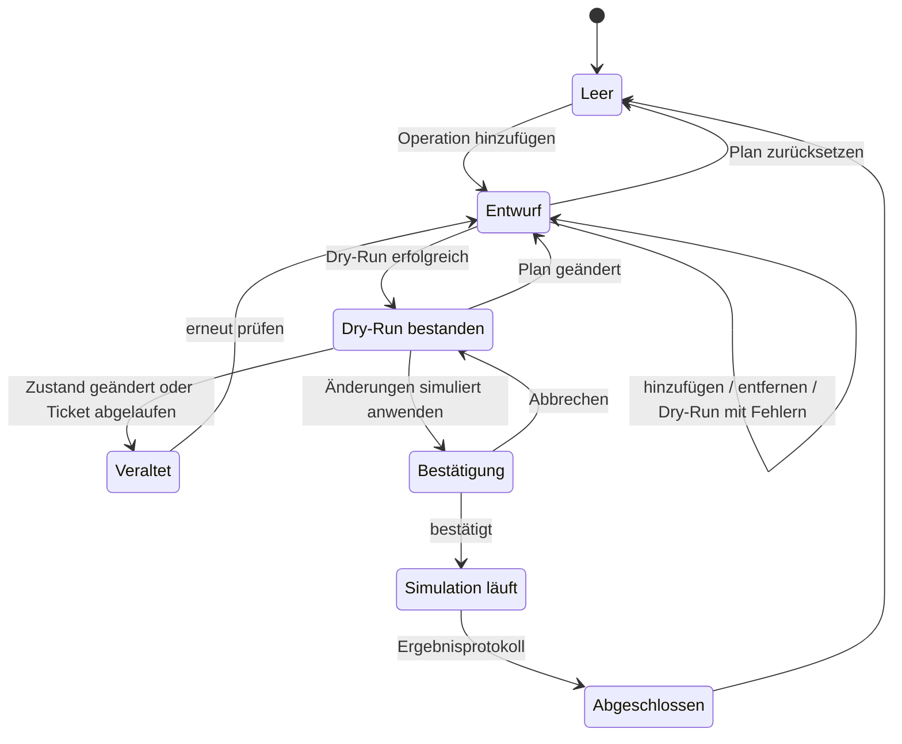

# MoonDisk – Sicherheitsmodell

> **Status:** Konzept (Phase 1) · **Gilt für:** `0.1.0-alpha.x`
>
> Verwandte Dokumente: [Architektur](architecture.md) ·
> [Unterstützte Operationen](supported-operations.md) ·
> [Bug-Reporter](bug-reporter.md)

## 1. Schutzziele (in dieser Rangfolge)

1. **Echte Nutzerdaten werden unter keinen Umständen verändert.**
2. **Persönliche Daten verlassen den Rechner nicht ohne Wissen und Zustimmung des Nutzers.**
3. **Nutzer verstehen jederzeit, was passiert.** Simulation und Realität sind
   eindeutig unterscheidbar, Konsequenzen werden vorher klar benannt.
4. **Nachvollziehbarkeit.** Jede geplante, geprüfte und simulierte Operation
   ist protokolliert und kann exportiert werden.

Bei Zielkonflikten gewinnt immer das höherrangige Ziel. Komfort und
Funktionsumfang sind nachrangig.

## 2. Bedrohungs- und Fehlermodell

| ID  | Risiko | Beispiel | Gegenmaßnahmen |
| --- | ------ | -------- | -------------- |
| T1  | Unbeabsichtigte Schreiboperation auf echte Datenträger | Programmierfehler, falsch verdrahteter Provider | Schutzschichten L1–L7 (§3) |
| T2  | Command Injection | Label `"; rm -rf /` gelangt in einen Befehl | Keine Shell. Nutzereingaben fließen nie in Prozessargumente. Prozessaufrufe gibt es nur über das `ReadOnlyTool`-Enum mit festen Argumenten (§3, L4). |
| T3  | Kompromittierte Webview (z. B. XSS über ein Label) ruft IPC auf | Eingeschleustes Skript löst `plan_apply` aus | React-Escaping, kein `dangerouslySetInnerHTML`, strikte CSP. Die Webview hat keine Plugin-Rechte. Das Backend prüft Dry-Run-Ticket und Bestätigungsphrase selbst. Im Alpha-Ernstfall kann ohnehin nur der Mock-Zustand verändert werden. |
| T4  | Verwechslung von Simulation und Realität | Nutzer glaubt, eine echte Partition sei gelöscht | Dauerhafter Modus-Banner. Dialogtitel, Ergebnismeldungen und Logs sind mit „Simulation“ gekennzeichnet. |
| T5  | Veralteter Plan | Der Zustand hat sich zwischen Planung und Ausführung geändert | Zustands-Fingerprints, erneute Validierung, Abbruch (§5.4) |
| T6  | Preisgabe persönlicher Daten im Bug-Report | Seriennummer oder Benutzername in einem Pfad | Strukturierte Anonymisierung, Text-Sanitizer, Opt-in je Diagnosewert, Vorschau des finalen Textes ([Bug-Reporter](bug-reporter.md)) |
| T7  | Token-Leck | Token landet in Log, Absturzmeldung oder Datei | `SecretString` und Zeroize. Nur im Arbeitsspeicher oder im OS-Schlüsselspeicher, nie in Dateien, Logs oder URLs. Redaction-Layer. |
| T8  | Doppelter oder ungewollter Versand | Doppelklick, automatischer Retry nach Timeout | Einmal-Ticket, kein automatischer Retry bei unklarem Status |
| T9  | Kompromittierte Abhängigkeit (Lieferkette) | Bösartiges npm-Paket | Lockfiles, `npm ci`, cargo-deny, per SHA gepinnte Actions, Review neuer Abhängigkeiten, Dependabot |
| T10 | Manipulierte Release-Artefakte | Ausgetauschtes Installationspaket | Nur CI-Builds, SHA-256-Prüfsummen, Build-Provenance-Attestierung |
| T11 | Start mit erhöhten Rechten | App wird als root oder Administrator gestartet | Die Alpha nutzt keine Rechte. `PrivilegeStatus` zeigt einen Hinweis, dass erhöhte Rechte weder nötig noch empfohlen sind. |

## 3. Alpha-Schreibsperre

Die Schreibsperre beruht auf mehreren unabhängigen Schichten (Defense in
Depth). Jede Schicht allein soll reichen, um T1 zu verhindern.

| Schicht | Maßnahme | Prüfung |
| ------- | -------- | ------- |
| **L1 Architektur** | Für echte Geräte gibt es **keinen** Schreibcode. `DiskOperationExecutor` hat genau eine Implementierung, `MockExecutor`, und die arbeitet ausschließlich auf dem In-Memory-Zustand `MockState`. | Code-Review, CODEOWNERS |
| **L2 Typsystem** | `DiskInventory` bietet nur lesende Methoden. `MockExecutor` bekommt `&mut MockState` und hat keinen Zugriff auf Geräte, Dateien oder Prozesse. Ein `RealExecutor`-Typ existiert nicht. | Kompilierung |
| **L3 Laufzeit** | `security::write_barrier::REAL_WRITES_ENABLED` ist `const false`. Jeder Ausführungspfad ruft `WriteBarrier::ensure_simulation(mode)` auf. Außerhalb von `mock` endet das mit `E_WRITES_DISABLED`. | Unit-Test prüft `false`, Integrationstest prüft die Ablehnung in `readonly` und `production` |
| **L4 Prozesse und Geräte** | Kein Shell-Plugin, keine Shell. Prozessaufrufe gibt es ausschließlich in `platform/process.rs` über das Enum `ReadOnlyTool` (Alpha: nur `lsblk`) mit festen Argumenten, geleerter Umgebung (`LC_ALL=C`), Timeout und Ausgabelimit. **Blockgeräte werden nie geöffnet, auch nicht lesend.** Die Read-only-Provider lesen nur Metadaten (lsblk, sysfs, WMI). | Safety-Scan, Tests |
| **L5 CI-Safety-Scan** | Verbotene Befehle, APIs, Plugins und Capabilities lassen den Build scheitern ([Release-Prozess §3](release-process.md#3-safety-scan)). | CI, Pflicht für Merge |
| **L6 Review-Prozess** | `CODEOWNERS` für `security/`, `platform/`, `operations/`, `github/`, `capabilities/` und `.github/workflows/`. PR-Checkliste „Keine Schreiboperation auf echte Geräte“. | GitHub Branch Protection |
| **L7 Oberfläche** | Der Modus-Banner lässt sich nicht ausblenden. Aktionen außerhalb von `mock` sind deaktiviert und begründet. Ergebnisse tragen „Simulation – es wurden keine echten Laufwerke verändert“. | Manuelle Alpha-Tests, UI-Tests |

```rust
// src-tauri/src/security/write_barrier.rs (Skizze)

/// In 0.1.0-alpha.x fest auf `false`.
/// Eine Änderung braucht ein Sicherheits-Review und die ausdrückliche
/// Freigabe der Maintainer (siehe docs/safety-model.md §10).
pub const REAL_WRITES_ENABLED: bool = false;
```

## 4. Betriebsmodi und sicherer Mock-Modus

### 4.1 Grundsatz

Der `MockDiskProvider` erzeugt seine Daten ausschließlich aus
**einkompilierten, deterministischen Szenario-Definitionen** und hält sie im
Arbeitsspeicher. Er öffnet keine Dateien und Geräte, startet keine Prozesse
und nutzt kein Netzwerk. Im Mock-Modus werden die Read-only-Provider gar nicht
erst erzeugt.

### 4.2 Aktivierung

| Quelle | Wirkung |
| ------ | ------- |
| keine Angabe | `mock` (Standard) |
| `MOONDISK_MODE=mock` | `mock` |
| `MOONDISK_MODE=readonly` | experimenteller Read-only-Modus, nur lesend |
| `MOONDISK_MODE=production` | in der Alpha wie `readonly`, mit Hinweis „nicht verfügbar“ |
| ungültiger Wert | `mock`, Warnung im Log und in der UI |
| `MOONDISK_MOCK_SCENARIO=<name>` | wählt das Mock-Szenario (§4.3), Standard `standard` |

Der Banner „Mock-Modus aktiv – es werden keine echten Laufwerke verändert.“
ist in jeder Ansicht sichtbar und lässt sich nicht schließen.

### 4.3 Mock-Szenarien

Das Szenario `standard` deckt alle geforderten Fälle ab. Hersteller und
Modelle sind **fiktiv**.

| ID | Modell / Hersteller (fiktiv) | Bus | Größe | Tabelle | Zustand | Partitionen (vereinfacht) | Testzweck |
| -- | ---------------------------- | --- | ----- | ------- | ------- | ------------------------- | --------- |
| `mock-disk-0` | Lunaris NV-1000 / Lunaris Storage | NVMe | 1 TB | GPT | OK | EFI (FAT32, 100 MiB) · MSR (16 MiB) · **C:** NTFS „System“ (System, gesperrt) · Recovery (NTFS, 750 MiB) · *nicht zugewiesen ~120 GiB am Ende* | Windows-Systemdatenträger. Geschützte Partitionen. C: lässt sich nicht vergrößern, weil die Recovery-Partition dazwischen liegt (`E_NO_ADJACENT_SPACE`). |
| `mock-disk-1` | Selene S2-512 / Selene Systems | NVMe | 512 GB | GPT | OK | EFI (FAT32, 512 MiB, `/boot/efi`) · `/boot` ext4 1 GiB · `/` Btrfs 180 GiB (System) · Swap 8 GiB · *nicht zugewiesen 40 GiB* · `/home` ext4 ~247 GiB | Linux-System, Swap, Boot. Freier Speicher liegt *vor* `/home`: Vergrößern geht nur nach Verschieben (zeigt Move + Resize). |
| `mock-disk-2` | Nachtfalter HD-2000 / Nachtfalter Data | SATA-HDD | 2 TB | MBR | **Warnung** (simulierter S.M.A.R.T.-Wert: umgelagerte Sektoren) | **D:** NTFS „Archiv“ 900 GiB · ext4 400 GiB · XFS 300 GiB · *nicht zugewiesen ~263 GiB* | MBR-Grenze: Nach einer neuen Partition sind 4 primäre erreicht, die nächste scheitert mit `E_MBR_PRIMARY_LIMIT`. XFS lässt sich nicht verkleinern. Zustandswarnung. |
| `mock-disk-3` | Sternschnuppe Stick 64 / Sternschnuppe | USB | 64 GB | MBR | OK | **E:** exFAT „STICK“ 59,6 GiB | Wechseldatenträger. exFAT ohne Größenänderung. Simuliertes Trennen. |
| `mock-disk-4` | MoonDisk Virtual Disk | virtuell | 64 GiB | GPT | OK | *vollständig nicht zugewiesen* | Partitionen von Grund auf erstellen und formatieren. |
| `mock-disk-5` | Komet SSD 256 / Komet Solid State | SATA-SSD | 256 GB | GPT | OK | NTFS 100 GiB · FAT32 32 GiB · ext3 30 GiB · ext2 8 GiB · Unbekannt 20 GiB · *nicht zugewiesen* | Dateisystemvielfalt. Unbekanntes Dateisystem: fast alle Aktionen gesperrt. |
| `mock-disk-6` | Nachtfalter Flash 16 / Nachtfalter Data | USB | 16 GB | MBR | OK, **schreibgeschützt** | FAT32 „FOTOS“ 14,9 GiB | Alle ändernden Aktionen deaktiviert und begründet (`E_DISK_READ_ONLY`). |
| `mock-disk-7` | MoonDisk Fehlertest | virtuell | 32 GiB | GPT | OK, Fehlerinjektion aktiv | ext4 16 GiB · *nicht zugewiesen* | Ausführungsfehler: Die 2. Operation eines Plans scheitert mit `E_SIM_IO_ERROR` (§4.4). |

Abgedeckt sind damit: GPT und MBR; NTFS, FAT32, exFAT, ext2, ext3, ext4,
Btrfs, XFS, Linux Swap und Unbekannt; SATA, NVMe, USB und virtuell;
Boot-, EFI-, Recovery-, MSR- und Swap-Partitionen; nicht zugewiesener
Speicher; die Zustände OK, Warnung und schreibgeschützt.

Weitere Szenarien für Tests und die Alpha:

| Szenario | Inhalt | Zweck |
| -------- | ------ | ----- |
| `empty` | keine Datenträger | Leerzustand mit Axolotl |
| `many` | 24 Datenträger mit bis zu 30 Partitionen | Layout, Scrollen, Performance |
| `faults` | wie `standard`, zusätzlich ein Datenträger im Zustand `Failing` und eine Mock-Datenquelle, die beim Laden einen Fehler meldet | Fehlerdarstellung |

### 4.4 Simulierte Fehlerzustände

Alle Fehler sind **deterministisch**, es gibt keinen Zufall. Die Zeit wird in
Tests über einen `Clock`-Trait gesteuert.

1. **Validierungsfehler** ergeben sich aus den Regeln in
   [Unterstützte Operationen](supported-operations.md), zum Beispiel fehlender
   angrenzender Speicher, gesperrte Systempartition, Verkleinern unter den
   belegten Platz, eine Operation, die das Dateisystem nicht unterstützt,
   MBR-Grenze, Überlappung, ungültiges Label, doppelter Laufwerksbuchstabe
   oder schreibgeschützter Datenträger.
2. **Ausführungsfehler** über Fehlerinjektion (`mock-disk-7`): Die Ausführung
   bricht bei der betroffenen Operation ab. Vorherige Operationen gelten als
   (simuliert) angewendet, nachfolgende nicht. Das Ergebnisprotokoll zeigt
   genau, was passiert ist. Das entspricht dem realistischen Verhalten echter
   Partitionswerkzeuge, die sequenziell arbeiten.
3. **Veralteter Plan** über die Mock-Werkzeuge (§4.5).
4. **Gerät entfernt** (`E_SIM_DEVICE_REMOVED`), wenn ein USB-Datenträger
   simuliert getrennt wird, während ein Plan ihn betrifft.

### 4.5 Mock-Werkzeuge

Diese Werkzeuge sind nur im Mock-Modus sichtbar und liegen unter Einstellungen
→ „Mock-Werkzeuge“:

- Szenario wählen oder zurücksetzen
- Externe Änderung simulieren (ändert z. B. ein Label oder die Belegung eines
  Datenträgers → Fingerprint ändert sich)
- USB-Datenträger simuliert trennen oder verbinden
- Simulierte Plattformansicht (Windows oder Linux)
- Simulationsgeschwindigkeit („sofort“ oder „realistisch“ mit
  Schritt-für-Schritt-Fortschritt)

Das Backend lehnt diese Commands außerhalb des Mock-Modus mit
`E_MODE_NOT_ALLOWED` ab.

### 4.6 Nachweis „Mock berührt nie echte Datenträger“

- Im Mock-Modus wird ein `DenyAllProcessRunner` verwendet. Jeder
  Prozessaufruf scheitert, und ein Integrationstest spielt den kompletten
  Workflow durch (laden → planen → Dry-Run → anwenden) und prüft, dass es
  **null** Aufrufe gab.
- Die Read-only-Provider werden im Mock-Modus nicht konstruiert. Ein Test
  prüft `InventorySource::Mock`.
- Der Safety-Scan (L5) erlaubt Gerätepfade wie `/dev/nvme0n1` nur als
  Anzeige-Strings in `platform/mock/` und verbietet dort jeden Datei- oder
  Prozesszugriff.

## 5. Operationsplaner

### 5.1 Lebenszyklus



Der **sichtbare Zustand** der Datenträger ändert sich erst im Schritt
„Simulation läuft → Abgeschlossen“. Vorher gibt es nur die klar markierte
Ansicht „Vorschau nach Plan“.

### 5.2 Felder einer geplanten Operation

| Feld | Typ | Bedeutung |
| ---- | --- | --------- |
| `id` | UUID v4 | eindeutige Operations-ID |
| `kind` | Enum mit typisierten Parametern | Operationstyp, siehe [Unterstützte Operationen §1](supported-operations.md#1-operationen-und-verfügbarkeit) |
| `disk_id` | `DiskId` | betroffener Datenträger |
| `partition_id` | `Option<PartitionId>` | betroffene Partition (beim Erstellen der Ziel-Freibereich) |
| `before` | `SegmentSnapshot` | vorheriger Zustand (Bereich, Dateisystem, Label, Buchstabe, Mountpoints) |
| `after` | `SegmentSnapshot` | geplanter neuer Zustand |
| `risk` | `Low` \| `Medium` \| `High` \| `Critical` | Risikostufe (§7) |
| `required_privilege` | Enum | im Mock „Keine (Simulation)“, informativ ergänzt um den Bedarf einer echten Ausführung (Administrator oder root) |
| `offline_hint` | `None` \| `UnmountRequired` \| `RebootRequired` \| `LongRunning` | Hinweis auf Trennen, Neustart oder lange Laufzeit |
| `created_at` | UTC-Zeitstempel | Zeitpunkt der Planung |
| `base_fingerprint` | SHA-256 | Zustand des Datenträgers bei der Planung |

### 5.3 Planregeln

- Operationen werden **sequenziell projiziert**. Jede wird gegen den Zustand
  *nach* den vorherigen Operationen validiert.
- Wird eine Operation entfernt, werden alle nachfolgenden neu validiert.
  Ungültig gewordene Operationen werden markiert, nicht stillschweigend
  entfernt (`E_PLAN_CONFLICT`).
- Operationen auf eine Partition, die im selben Plan gelöscht wird, sind
  ungültig.
- Ein Plan hat höchstens 32 Operationen (`E_PLAN_TOO_LARGE`).
- Plan zurücksetzen verwirft alle Operationen und Tickets. Der Mock-Zustand
  bleibt unverändert.

### 5.4 Zustands-Fingerprint und Revalidierung

- Fingerprint pro Datenträger: SHA-256 über eine kanonische Serialisierung
  (Bereiche, Dateisysteme, Labels, Flags, Buchstaben, Mountpoints, Zustand),
  zusätzlich die Revisionsnummer des Mock-Zustands.
- **Vor dem Dry-Run und vor der Ausführung** berechnet das Backend alle
  Fingerprints neu. Weicht einer von `base_fingerprint` ab, bricht es mit
  `E_STATE_CHANGED` ab. Der Plan wechselt nach „Veraltet“, und der Nutzer muss
  erneut prüfen.

### 5.5 Dry-Run

- Der Dry-Run ist eine **reine Funktion**:
  `simulate(kopie_des_zustands, plan) -> DryRunReport`. Der echte Mock-Zustand
  wird dabei nicht berührt.
- Der Bericht enthält pro Operation Ergebnis, Warnungen und Fehlercodes, außerdem
  das resultierende Layout und die nötigen Bestätigungen (Phrase,
  Backup-Hinweis).
- Ist alles erfolgreich, stellt das Backend ein **Dry-Run-Ticket** aus
  (`ticket_id`, Plan-Hash, Fingerprints, Ausstellungszeit). Es ist nur für diesen
  Plan gültig, nur einmal verwendbar und läuft nach 15 Minuten ab.

### 5.6 Simulierte Ausführung

`plan_apply(ticket_id, confirmation)` prüft im Backend der Reihe nach:

1. Modus ist `mock`, sonst `E_MODE_NOT_ALLOWED` bzw. `E_WRITES_DISABLED`
2. Ticket existiert, passt zum aktuellen Plan-Hash und ist nicht abgelaufen
   (`E_DRY_RUN_REQUIRED`, `E_DRY_RUN_EXPIRED`)
3. Fingerprints unverändert (`E_STATE_CHANGED`)
4. Bestätigungsphrase vorhanden und korrekt, falls der Plan kritische
   Operationen enthält (`E_CONFIRMATION_MISSING`)
5. Backup-Bestätigung vorhanden, falls der Plan Operationen mit hohem Risiko
   enthält
6. Schreibsperre `WriteBarrier::ensure_simulation`

Danach wendet der `MockExecutor` die Operationen sequenziell an und hält beim
ersten Fehler an. Das Ergebnisprotokoll nennt pro Operation Status, Dauer
(simuliert) und Fehlercode. Die UI schließt mit:

> **Simulation abgeschlossen.** Es wurden keine echten Laufwerke verändert.

## 6. Validierung von Eingaben

| Ebene | Aufgabe |
| ----- | ------- |
| Frontend (Zod) | Sofortige Rückmeldung in Formularen (Größe, Label, Buchstabe, Mountpoint). Grenzwerte kommen aus `validation_rules`. |
| IPC-Grenze (Serde) | Typisierte Structs, `deny_unknown_fields`, Newtype-IDs, Zahlen ≤ 2^53 − 1 |
| Backend-Eingaberegeln | Unicode-Normalisierung (NFC), Längengrenzen, Zeichen-Allowlists, keine Steuerzeichen, Pfad-Normalisierung ohne `..` |
| `OperationValidator` | Fachliche Regeln (Überlappung, Ausrichtung, Dateisystemgrenzen, Schutzregeln) |

Das Backend vertraut dem Frontend nie. Jede Regel wird dort erneut und
maßgeblich geprüft.

## 7. Risikostufen und Bestätigungen

| Risiko | Operationen | Anforderungen vor der simulierten Ausführung |
| ------ | ----------- | -------------------------------------------- |
| **Niedrig** | Label ändern, Laufwerksbuchstaben oder Mountpoint setzen/entfernen | Plan + Dry-Run + normale Bestätigung |
| **Mittel** | Partition erstellen, vergrößern | wie Niedrig, dazu Backup-Hinweis im Bestätigungsdialog |
| **Hoch** | Verkleinern, Verschieben | wie Mittel, dazu Checkbox „Ich habe ein aktuelles Backup“ (bei echter Ausführung: Datenverlust bei Unterbrechung möglich) |
| **Kritisch** | Löschen, Formatieren | wie Hoch, dazu **Texteingabe der Bestätigungsphrase** (§8) |

## 8. Sicherheitsdialog für kritische Aktionen

Der Dialog erscheint beim Anwenden eines Plans, der kritische Operationen
enthält. Er listet **jede** kritische Operation einzeln auf. Gestaltung:
sachlich, ohne Maskottchen, ohne Emojis, ohne Humor, Fehlerfarbe als Akzent.

```text
┌──────────────────────────────────────────────────────────────────────┐
│  Kritische Änderungen simulieren                                     │
│                                                                      │
│  Partition löschen (Simulation)                                      │
│    Datenträger:  Datenträger 1 – Selene S2-512 (Mock)                │
│    Partition:    Nr. 5 · 247,0 GiB · ext4 · Label „home“             │
│    Folge:        Die Partition und alle darauf gespeicherten Daten   │
│                  würden unwiderruflich entfernt. Im Mock-Modus wird  │
│                  nur der simulierte Zustand geändert.                │
│                                                                      │
│  Erstelle vor echten Partitionsänderungen immer ein Backup.          │
│                                                                      │
│  Gib LÖSCHEN ein, um fortzufahren:  [                    ]           │
│                                                                      │
│  [ Abbrechen ]                          [ Simulation ausführen ]     │
│                                            (erst aktiv bei korrekter │
│                                             Eingabe)                 │
└──────────────────────────────────────────────────────────────────────┘
```

Regeln:

1. Angezeigt werden Datenträgername, Partitionsnummer, Größe, Dateisystem und
   Volume-Label.
2. Die simulierte Konsequenz wird eindeutig erklärt.
3. Die Phrase wird exakt verglichen, nachdem beide Seiten nach **Unicode NFC**
   normalisiert und führende sowie nachfolgende Leerzeichen entfernt wurden
   („Ö“ kann auf verschiedenen Tastaturen unterschiedlich kodiert ankommen).
   Die Prüfung erfolgt **im Frontend und im Backend**.
4. Phrase je Sprache: `LÖSCHEN` (Deutsch), Vorschlag `DELETE` (Englisch),
   Entscheidung **D4** ([Roadmap](roadmap.md#6-offene-entscheidungen)).
5. Der Button „Abbrechen“ ist deutlich sichtbar. `Esc` bricht ab. `Enter` löst
   nichts aus, solange die Phrase nicht stimmt.
6. Der Fokus startet im Eingabefeld und bleibt im Dialog (Fokusfalle). Beim
   Schließen kehrt er zum auslösenden Element zurück.
7. Nach Abschluss erscheint ausdrücklich: „Es wurde nur eine Simulation im
   Mock-Modus durchgeführt.“

## 9. Protokollierung und Geheimnisse

- **Was protokolliert wird:** Modus beim Start, geplante, entfernte, geprüfte
  und simulierte Operationen (mit IDs und Fehlercodes), Validierungsfehler,
  Bug-Report-Aktionen *ohne Inhalt*, GitHub-Ergebnisse *nur* mit Zeit und
  Issue-Nummer bzw. HTTP-Status.
- **Was nie protokolliert wird:** Tokens, Device-Codes, Inhalte von Berichten,
  vollständige Seriennummern, vollständige Pfade mit Benutzernamen.
- **Redaction-Layer:** Vor dem Schreiben werden Token-Muster, Home-Pfade und der
  Benutzername maskiert, mit denselben Regeln wie der Sanitizer
  ([Bug-Reporter §5](bug-reporter.md#5-anonymisierung)).
- **Speicherorte:** Ringpuffer (2 000 Einträge) im Arbeitsspeicher. Rotierende
  Datei im Log-Verzeichnis der App (höchstens 5 × 1 MiB). Unter Linux ist das
  das Datenverzeichnis unterhalb von `$XDG_DATA_HOME/io.moondisk.app/`, unter
  Windows `%LOCALAPPDATA%\io.moondisk.app\`. Der genaue Pfad wird in Phase 11
  mit der Tauri-API ermittelt.
- **Export** nur über einen Speichern-Dialog, den Rust öffnet.

## 10. Voraussetzungen für echte Schreiboperationen in späteren Versionen

Echte Schreiboperationen werden **nicht** in einer Alpha aktiviert. Bevor
`REAL_WRITES_ENABLED` jemals geändert wird, müssen alle folgenden Punkte
erfüllt sein:

1. Ein getrennter, minimaler Hilfsprozess mit erhöhten Rechten und typisiertem
   Protokoll, ohne generische Befehlsausführung
   ([Architektur §11.4](architecture.md#114-ausblick-architektur-für-spätere-schreiboperationen)).
2. Ausführung über strukturierte OS-APIs (UDisks2/libblockdev, Windows Storage
   Management API) statt über das Parsen von Textausgaben.
3. Schutz, der standardmäßig greift: Systemdatenträger, Boot- und
   EFI-Partitionen, eingehängte bzw. aktive Volumes, BitLocker-, LUKS-, RAID-
   und LVM-Mitglieder.
4. Unmittelbar vor **jedem** Schritt eine Revalidierung gegen den frischen
   echten Zustand.
5. Ein Operationsjournal, damit sich unterbrochene Operationen erkennen und
   nachvollziehen lassen.
6. Automatisierte Tests auf Wegwerf-Medien (Loop-Devices, VHDX in VMs) und eine
   manuelle Testmatrix.
7. Ein externes Sicherheits-Review und eine Beta-Phase.
8. **Die ausdrückliche Freigabe der Maintainer.** Das Projekt fragt vor der
   Aktivierung privilegierter Schreibfunktionen immer nach.
